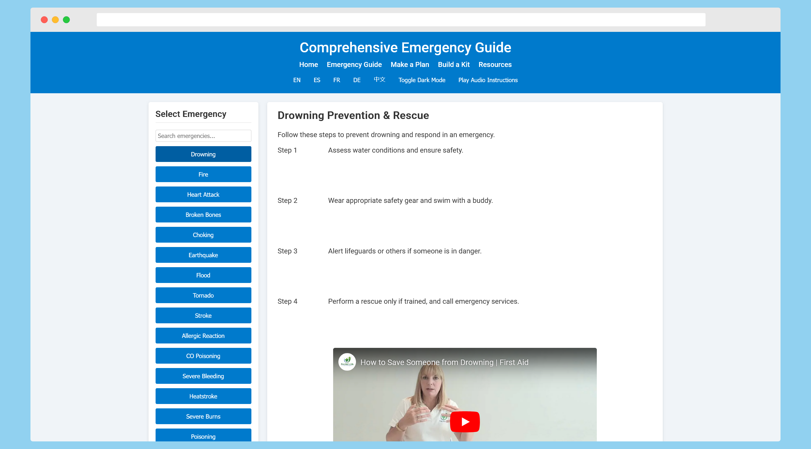

# Emergency Scenarios Guide

A fully deployable progressive web application designed to help users quickly access step-by-step instructions for a wide range of emergency scenarios—from drowning and fires to heart attacks, earthquakes, and cybersecurity incidents.

## Features

- **Multilingual Support:** Available in English, Spanish, French, German, and Chinese.
- **User-Centric Design:** Responsive interface with an intuitive sidebar, top navigation, and search/filter functionality.
- **Interactive Features:** Integrated video demos, downloadable resources, and interactive elements.
- **Advanced Functionality:**
  - **Text-to-speech:** Voice instructions powered by the Web Speech API.
  - **Geolocation:** Uses a free IP-based API to display local emergency numbers.
  - **Offline Capabilities:** Service worker ensures offline access.
  - **Dark Mode:** Toggle for comfortable viewing in any lighting.
- **Accessibility & UX Focus:** Built with semantic HTML, ARIA roles, and optimized for users of all abilities.
